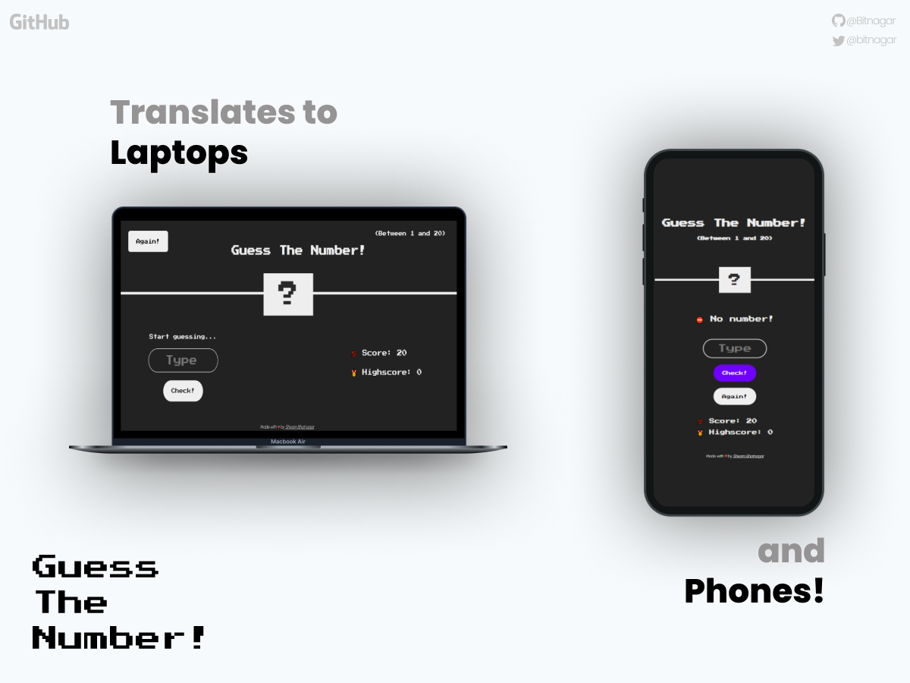

# 🎇 Guess-The-Number-Game 🔥
### Guess a random number between a range. Take minimum chances to score the maximum!

  
Table of Contents

  <ol>
    <li>
      <a href="#about-the-game">About The Project 🧾</a>
    <li><a href="#live-demo">Live Demo ▶</a></li>
    </li>
    <li><a href="#built-with">Built With 🛠</a></li>
    <li>
      <a href="#how-to-play">How To Play? ❔</a>
    <li><a href="#usage">Usage ⛽</a></li>
    <li><a href="#contributing">Contributing 🤵🏻</a></li>
    <li><a href="#license">License 🏫</a></li>
    <li><a href="#contact">Contact 📧</a></li>
  </ol>

## About The Game 

Guess a number between a range (1 to 20 for this code) and match it with the random number generated by the game. Take minimum chances to guess and you will score the maximum.

This games translates to various devices of any width and height, so as to make it playable almost on every laptop 💻 and phone 📱.
(as of 2021)

## Live Demo
Play it at: https://guessthenumbr.netlify.app/

### Built With

This game is Built using the following languages. (No Frameworks)
* [HTML](https://developer.mozilla.org/en-US/docs/Web/HTML)
* [CSS](https://developer.mozilla.org/en-US/docs/Web/CSS)
* [JavaScript](https://developer.mozilla.org/en-US/docs/Web/JavaScript)

### How To Play?

* Guess a random number between 1 and 20 generated automatically by the game.
* Type your number in the input field and press "check" to match your number with number generated by the game.
* You have 20 chances to guess the number or you will lose the game.
* Take minimum chances to score the highest.
* Pressing "again" will reset the entire game, that means scores will reset and a new random number will be generated again.

### USAGE 

* You can use this project to learn basic web development and JavaScript.
* Run it locally on your system. Think about what can be changed. Make changes in the game locally.
* If you like what you have changed, then you can make a pull request to update the code here.

## Contributing
Take the code, run it and think about what can be edited and make your pull request to update the game.

## License

Distributed under the MIT License. See `LICENSE` for more information.

## Contact

Shivam Bhatnagar - [bitnagar](https://twitter.com/bitnagar)

Project Link: [https://github.com/Bitnagar/Guess-The-Number-Game](https://github.com/Bitnagar/Guess-The-Number-Game/)

Live Demo: https://guessthenumbr.netlify.app/

## Thanks for considering it. I hope you liked it. More to come! ❤
